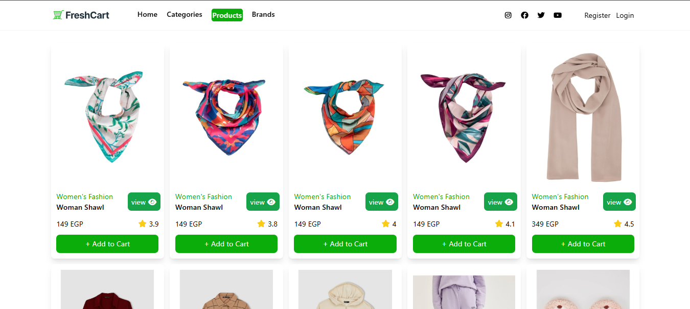
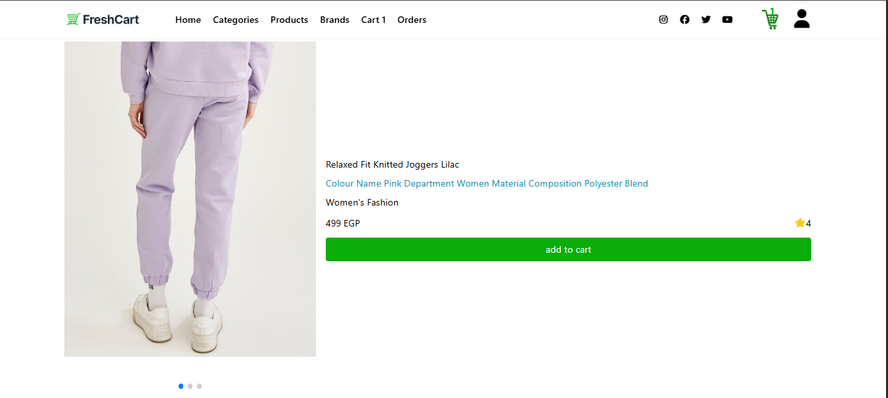
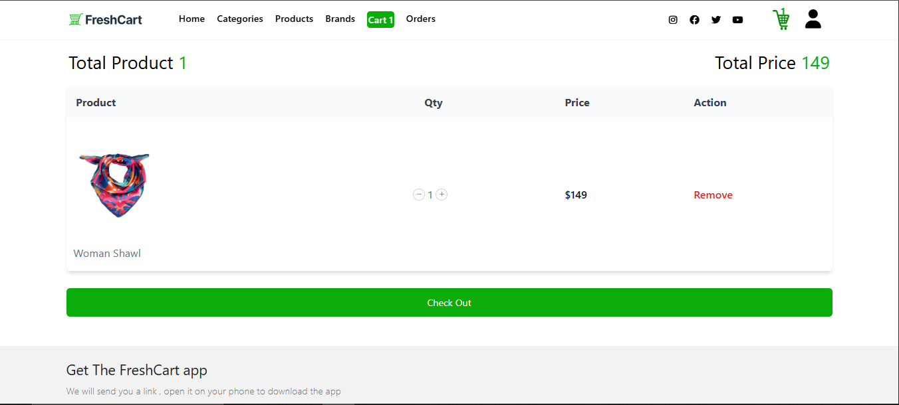
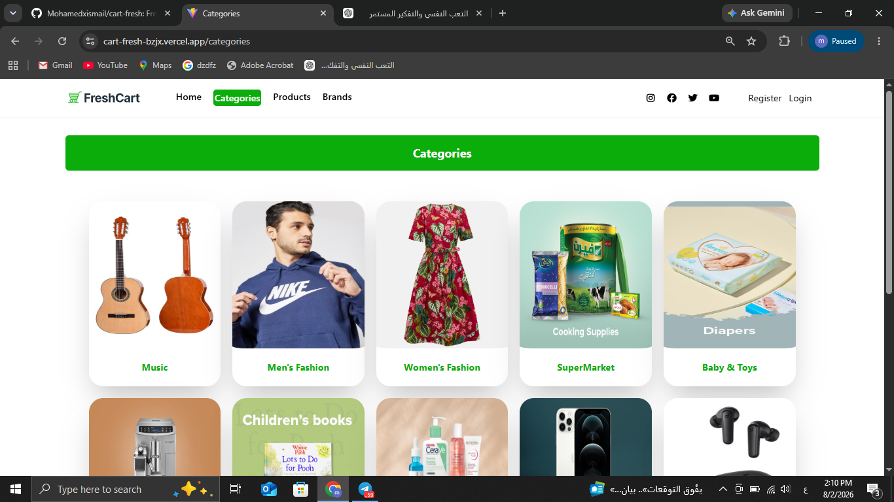
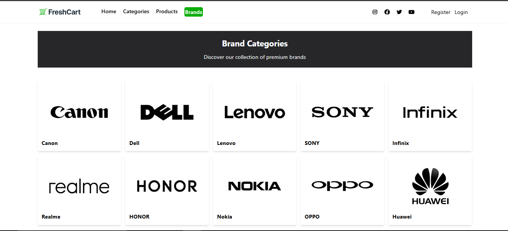
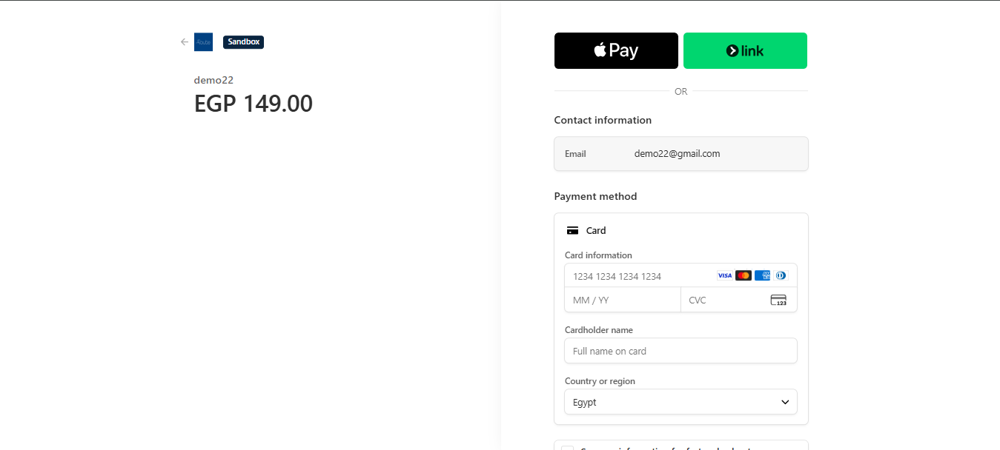

<h1 align="center">🛒 FreshCart</h1>

<p align="center">
A Modern & Fully Responsive E-Commerce Web Application built with React & Vite.
</p>

<p align="center">
  
  
  
  
  
</p>

<p align="center">
  <a href="https://cart-fresh-bzjx.vercel.app/">
    
  </a>

  <a href="https://github.com/Mohamedxismail/cart-fresh">
    
  </a>
</p>

---

# 📖 About The Project

**FreshCart** is a modern, fully responsive **E-Commerce Web Application** built using **React** and **Vite**.

The application allows visitors to browse products, categories, and brands without authentication. Users can freely explore the store, while actions such as adding products to the shopping cart, placing orders, editing their profile, changing passwords, and viewing order history require authentication.

To simplify testing, a **Demo Account** is available directly from the Login page, allowing recruiters and users to experience all authenticated features instantly.

The project focuses on creating a clean, responsive, and user-friendly shopping experience while following modern React development practices and reusable component architecture.

---

# 🚀 Live Demo

🌐 **Website**

https://cart-fresh-bzjx.vercel.app/

💻 **GitHub Repository**

https://github.com/Mohamedxismail/cart-fresh

---

# ✨ Features

- 🔐 Authentication (Login & Register)
- 👤 Demo Account
- 🔒 Protected Routes
- 🛍 Browse Products without Login
- 📄 Product Details
- 📂 Browse Categories
- 🏷 Browse Brands
- 🛒 Shopping Cart Management
- ➕ Increase Product Quantity
- ➖ Decrease Product Quantity
- ❌ Remove Products from Cart
- 🔄 Real-Time Cart Updates
- 💳 Online Payment
- 💵 Cash On Delivery
- 📦 Orders History
- ✏️ Edit User Profile
- 🔑 Change Password
- 📱 Fully Responsive Design
- ⚡ Fast Loading Experience
- 🎨 Clean & Modern UI

---

# 🛠 Tech Stack

## Front-End

- React
- Vite
- React Router DOM
- React Hooks

## State Management

- Context API

## Styling

- Tailwind CSS
- Flowbite React

## Forms & Validation

- Formik
- Yup

## API

- REST API
- Axios

## UI Libraries

- React Toastify
- Swiper

## Deployment

- Vercel

---
# 📸 Screenshots

<table align="center">

<tr>
<td width="50%">

</td>

<td width="50%">

</td>
</tr>

<tr>
<td align="center"><b>🏠 Home Page</b></td>
<td align="center"><b>🛍 Products</b></td>
</tr>

<tr>
<td width="50%">

</td>

<td width="50%">

</td>
</tr>

<tr>
<td align="center"><b>📄 Product Details</b></td>
<td align="center"><b>🛒 Shopping Cart</b></td>
</tr>

<tr>
<td width="50%">

</td>

<td width="50%">

</td>
</tr>

<tr>
<td align="center"><b>📂 Categories</b></td>
<td align="center"><b>🏷 Brands</b></td>
</tr>

<tr>
<td colspan="2" align="center">

</td>
</tr>

<tr>
<td colspan="2" align="center">
<b>💳 Checkout & Online Payment</b>
</td>
</tr>

</table>

---

# 👤 Demo Account

To help recruiters and visitors explore the application quickly, a **Demo Account** is available directly on the Login page.

Simply click the **"Try Demo Account"** button to instantly sign in and access all authenticated features without creating a new account.

---

# ⚙️ Getting Started

Clone the repository

```bash
git clone https://github.com/Mohamedxismail/cart-fresh.git
```

Navigate to the project folder

```bash
cd cart-fresh
```

Install dependencies

```bash
npm install
```

Run the development server

```bash
npm run dev
```

Build for production

```bash
npm run build
```

---

# 📁 Project Structure

```text
src
│
├── assets
├── components
├── Context
├── Shared
├── App.jsx
├── main.jsx
└── ...
```

---
# 🚀 Future Improvements

The project can be extended with more advanced features in the future, including:

- ❤️ Wishlist
- 🔍 Product Search
- 🎯 Advanced Product Filtering
- ⭐ Product Reviews & Ratings
- 🌙 Dark Mode
- 🌍 Multi-language Support (i18n)
- 📱 Progressive Web App (PWA)
- 📧 Email Verification
- 🔔 Push Notifications
- 💖 Favorite Products
- 📊 Admin Dashboard

---

# 📱 Responsive Design

The application is fully responsive and optimized for all screen sizes:

- 💻 Desktop
- 💼 Laptop
- 📱 Tablet
- 📲 Mobile

---

# 📚 What I Learned

Building FreshCart helped me strengthen my skills in:

- React Fundamentals & Hooks
- Context API for Global State Management
- React Router DOM
- Protected Routes
- REST API Integration
- Axios
- Authentication Flow
- Form Validation using Formik & Yup
- Building Reusable Components
- Shopping Cart Logic
- Online Payment Integration
- Responsive UI Design with Tailwind CSS
- Error Handling & User Feedback
- Clean Folder Structure & Code Organization

---

# 👨‍💻 Author

## Mohamed Ismail

**Frontend Developer**

### GitHub

https://github.com/Mohamedxismail

### LinkedIn

www.linkedin.com/in/mohamed-ismail-81217a33b

---

# 🤝 Contributing

Contributions, issues, and feature requests are welcome.

If you'd like to improve this project:

1. Fork the repository.
2. Create a new branch.
3. Commit your changes.
4. Open a Pull Request.

---

# ⭐ Support

If you like this project, don't forget to leave a ⭐ on GitHub.

Your support motivates me to build more amazing projects.

---

<p align="center">
Made with ❤️ by Mohamed Ismail using React & Vite
</p>
